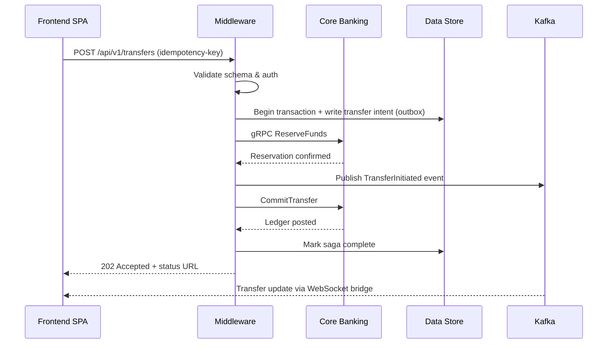

# Middleware Core Service Design

## 1. Mission
The middleware core service is the transactional heart of VirtualBank. It ingests player intents from the frontend, enforces
security and compliance, coordinates the execution of multi-step banking workflows across the core services layer, and exposes
an operations surface for Game Masters via secure SSH. The service must guarantee idempotent, auditable processing while staying
agile enough to bridge to the stockmarket simulation and future gameplay extensions.

## 2. Technology Stack
| Capability | Primary Choice | Rationale |
|------------|----------------|-----------|
| Runtime | **Node.js 22 LTS + TypeScript** | Matches the existing blueprint, provides mature ecosystem and developer velocity. |
| HTTP API | **Fastify** with JSON Schema validation (TypeBox) | High-performance routing, schema-first contracts, easy OpenAPI generation. |
| Internal RPC | **gRPC** (via `@grpc/grpc-js`) | Binary contracts to core banking and stockmarket services, strong typing, streaming support. |
| Messaging | **Apache Kafka** | Durable event log for transaction lifecycle events, outbox pattern, and Game Master broadcasts. |
| Data Access | **Prisma ORM** + PostgreSQL read replicas | Type-safe queries, connection pooling, and effortless partition routing. |
| Caching | **Redis Cluster** | Low-latency session storage, rate limiting tokens, and saga coordination checkpoints. |
| Containerization | **Docker** with distroless base image | Minimal attack surface, consistent deployments. |
| SSH Console | **Teleport OSS** gateway + curated command palette | Hardened SSH access, role-aware command restrictions, session recording. |
| Observability | **OpenTelemetry** + Prometheus + Loki | Unified tracing, metrics, and structured logging for investigations. |

## 3. Logical Components
1. **API Gateway Layer**
   - Terminates TLS (Mutual TLS for privileged actors) and validates JWTs issued by the Identity Service.
   - Applies per-actor rate limits and request quotas using Redis-backed token buckets.
   - Performs schema validation, idempotency key checking, and embeds correlation metadata into request context.

2. **Transaction Orchestrator**
   - Implements workflow sagas for transfers, credit actions, and market orders.
   - Uses the outbox pattern: writes to the transaction log table and publishes Kafka events in a single atomic step via PostgreSQL logical decoding.
   - Handles compensation logic (e.g., reversing ledger reservations) when downstream steps fail.

3. **Service Connectors**
   - gRPC clients for Core Banking services (Accounts, Ledger, Credit) and the Stockmarket Gateway.
   - Incorporate circuit breakers, retry budgets, and timeout policies defined per dependency tier.

4. **Data Access Layer**
   - Prisma models that map to partitioned PostgreSQL schemas (per-tenant + global).
   - Read replicas for reporting queries; writable primary for transactional commands.

5. **Event Streamer**
   - Publishes sanitized transaction events to Kafka topics consumed by the frontend real-time service.
   - Subscribes to Game Master directives (e.g., economy-wide adjustments) and applies them after signature verification.

6. **Admin SSH Console**
   - Teleport provides bastion + short-lived certificates.
   - Launches a curated CLI (`vb-admin`) built with Node.js `oclif`, exposing commands for investigating sessions, replaying sagas, and managing feature flags.
   - Session logs forwarded to Loki and archived in object storage for compliance.

## 4. API Surface
### 4.1 External REST Endpoints
| Path | Method | Description | Notes |
|------|--------|-------------|-------|
| `/api/v1/transfers` | POST | Initiate an account-to-account transfer. | Requires idempotency key; orchestrator saga across ledger + notification services. |
| `/api/v1/transfers/{id}` | GET | Retrieve transfer status and audit trail. | Supports long polling; includes saga step summaries. |
| `/api/v1/credits/applications` | POST | Submit a credit line request. | Auto-routes to Credit Service scoring via gRPC. |
| `/api/v1/market/orders` | POST | Place a simulated market order. | Validates player limits before streaming to stockmarket matching engine. |
| `/api/v1/sessions/stream` | GET (WebSocket) | Subscribe to transaction and portfolio updates. | Authenticated via JWT upgrade handshake. |

### 4.2 Internal gRPC Contracts
```proto
service TransactionWorkflow {
  rpc ReserveFunds(ReserveFundsRequest) returns (ReserveFundsResponse);
  rpc CommitTransfer(CommitTransferRequest) returns (CommitTransferResponse);
  rpc CancelTransfer(CancelTransferRequest) returns (CancelTransferResponse);
}

service MarketBridge {
  rpc SubmitOrder(OrderCommand) returns (OrderAck);
  rpc StreamMarketData(MarketStreamRequest) returns (stream MarketUpdate);
}
```
- Contracts versioned with protobuf options; backward compatibility enforced via CI contract tests.
- All calls secured with mTLS and short-lived SPIFFE identities issued by the service mesh.

## 5. Transaction Processing Lifecycle


## 6. Reliability & Scaling
- **Stateless containers** horizontally scale via Kubernetes HPA using CPU + custom latency metrics.
- **Connection Pooling** handled by Prisma Data Proxy to avoid exhausting PostgreSQL connections.
- **Resilience** through bulkhead isolation: separate worker pools for API requests and saga processors.
- **Idempotency**: Incoming commands must include an `Idempotency-Key` header; stored alongside hashed payload to prevent replay attacks.
- **Disaster Recovery**: Nightly backup/restore drills for PostgreSQL and Kafka; Teleport audit logs mirrored to cold storage.

## 7. Security Controls
- OAuth 2.1 with PKCE for end-user flows; service-to-service auth via SPIFFE identities.
- Field-level encryption for sensitive payload segments (e.g., identity attributes) using envelope encryption.
- Web Application Firewall (Kong or AWS WAF) positioned ahead of Fastify for threat mitigation.
- SSH console restricted to Game Masters with hardware-based WebAuthn authentication.
- Real-time anomaly detection pipeline subscribing to Kafka to flag suspicious transaction bursts.

## 8. Deployment Topology
1. **Build Stage**: GitHub Actions pipeline runs linting, unit tests, contract tests, and Docker image build.
2. **Artifact Storage**: Images pushed to a private registry with provenance attestations (Sigstore).
3. **Promotion**: Argo CD deploys to staging, runs smoke tests, then promotes to production via progressive delivery (canary releases with metrics checks).
4. **Runtime Environment**: Kubernetes namespace `virtualbank-middleware` with dedicated node pools supporting gVisor sandboxing.
5. **Secrets Management**: HashiCorp Vault issues dynamic Postgres credentials and mTLS certs; Teleport integrates with Vault for SSH cert signing.

## 9. Operations & Tooling
- **Runbooks** stored alongside this document, referencing standard operating procedures for incident response.
- **Dashboards**: Grafana boards for latency, throughput, error rates, and saga state transitions.
- **Synthetic Monitoring**: k6 scripts emulate key flows hourly; failures page on-call staff.
- **Feature Flags**: LaunchDarkly (or open-source OpenFeature stack) toggles experimental gameplay mechanics with audit trails.
- **Data Governance**: Regular privacy reviews ensure only fictional currency data is stored; PII-like data is minimized.

## 10. Roadmap Enhancements
- Implement async API layer (HTTP callbacks) for long-running operations to reduce client polling.
- Add confidential compute enclave for high-stakes Game Master events.
- Introduce DSL-driven workflow builder so designers can craft new sagas without code changes.
- Expand SSH console with "sandbox replay" mode that replays historical sessions in a controlled environment for storytelling events.

## 11. Summary
This middleware design delivers a resilient, auditable, and extensible transaction hub. It marries Fastify-based HTTP handling with
strongly typed gRPC integrations, Kafka-backed eventing, and a hardened SSH console so Game Masters can steer the economy safely.
Docker-first packaging and rigorous observability complete the foundation for a dependable VirtualBank core service.
