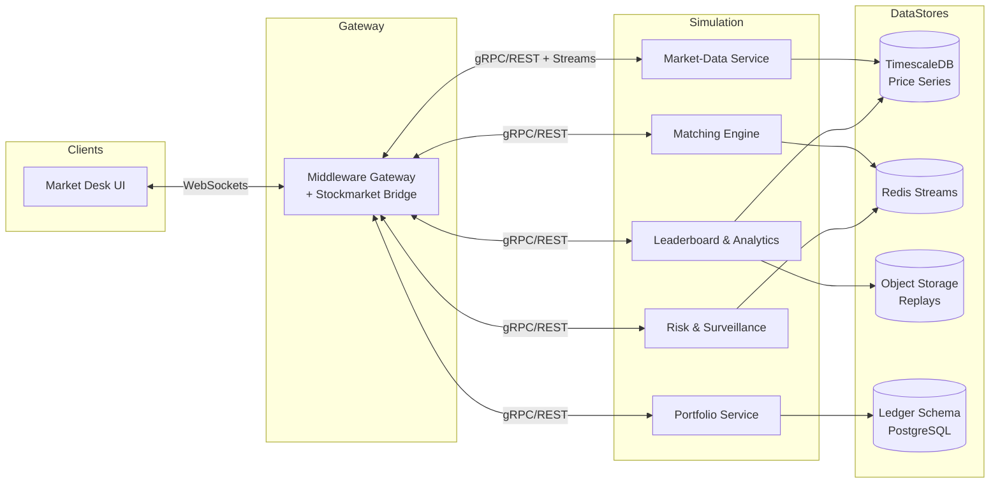

# Stockmarket Simulation Design

## 1. Purpose & Guiding Principles
The Stockmarket Simulation is the experiential heart of VirtualBank's trading fantasy. It must feel energetic and reactive while remaining predictable enough for learning. The component therefore prioritizes:

- **Believability:** Price movements, corporate events, and market regimes imitate real-world dynamics without requiring external data.
- **Responsiveness:** Traders expect sub-second updates on price ticks, order status, and portfolio changes.
- **Fair Play:** Anti-abuse controls and circuit breakers guarantee that competitive experiences remain fun rather than exploitable.
- **Modularity:** Each sub-service (data generation, matching, portfolios, analytics) evolves independently but communicates through well-defined contracts.

## 2. High-Level Architecture
The simulation is composed of five collaborating services orchestrated by a coordination fabric. Middleware acts as the secure boundary between VirtualBank clients and these real-time engines.

### 2.1 Service Responsibilities
- **Market-Data Service (MDS):** Generates synthetic tick-by-tick updates, aggregates historical bars, and emits contextual news.
- **Matching Engine (ME):** Processes player orders, maintains limit-order books per instrument, and streams trades and book updates.
- **Portfolio Service (PS):** Applies fills to user holdings, tracks cost basis, calculates realized/unrealized P&L, and coordinates dividend distribution.
- **Risk & Surveillance Service (RSS):** Enforces limits, detects suspicious trading behavior, triggers halts, and publishes compliance notices.
- **Leaderboard & Analytics Service (LAS):** Produces heatmaps, leaderboards, sector statistics, and handles replay generation.

Each service exposes REST endpoints for control operations and WebSocket/Redis streams for high-frequency data. Internal calls prefer gRPC for type safety; middleware exposes JSON over HTTP(S) and WebSockets to clients.

## 3. Data & Algorithm Strategy
### 3.1 Instruments & Dataset Integration
- Base instrument definitions originate from the curated JSON fixtures inside `dataset/` (`fake_companies.json`, `sample_portfolios.json`).
- An ingestion job loads these definitions into TimescaleDB, tagging each ticker with sector, volatility baseline, beta weight, and narrative hooks.
- Future datasets can be dropped into the directory and registered via an admin console, enabling hot reload of new fictional companies.

### 3.2 Regime Scheduler
A configurable scheduler rotates the market through scenarios defined in [`designing/design.md` §5.4](../../designing/design.md#54-market-simulation-bounded-context): Calm, Trend Up/Down, High Volatility, Crash/Boom.

- Each regime sets parameters such as drift, volatility, jump probability, and correlation modifiers.
- Regime transitions are persisted with timestamps so replays can reconstruct the same experience.
- A Monte Carlo generator seeds per-ticker noise series; correlation matrices ensure sector-linked behavior.

### 3.3 Price & Volume Generation
- **Base Model:** Geometric Brownian Motion (GBM) with adjustable drift and volatility.
- **Regime Overlays:** Apply deterministic trend lines, volatility multipliers, or jump events according to the active regime.
- **Event Engine:** Injects discrete shocks (earnings, meme rallies, dividend announcements) with configurable magnitude and decay curves.
- **Liquidity Modeling:** Volume curves mimic intraday patterns; spreads widen during stress to increase realism.

### 3.4 Order Book Dynamics
- Matching Engine keeps in-memory books per instrument using price-time priority.
- Opening/closing auctions consolidate overnight interest and publish indicative prices to the UI.
- Circuit breakers halt trading when cumulative moves breach thresholds; halts propagate via middleware to disable buy/sell controls.
- Maker/taker fees are simulated as adjustments to final fill prices and aggregated for leaderboard insights.

## 4. Integration Touchpoints
### 4.1 Middleware Bridge
- Authenticates user identities and roles using existing JWT claims from the VirtualBank session.
- Normalizes client order tickets into canonical commands (`PlaceOrder`, `CancelOrder`, `ModifyOrder`).
- Subscribes to Redis streams (order book, trades, news) and fans out updates over WebSockets to subscribed clients.
- Applies rate limiting and order throttling before forwarding to the Matching Engine.

### 4.2 Middleware Ledger Interop
- Portfolio Service synchronizes cash balances with the middleware-managed ledger schemas after each fill.
- Settlement occurs in fun currency using middleware-facilitated transfer procedures, ensuring buying power updates propagate to the general dashboard.
- Dividend and fee events create ledger entries attributed to the "Market" counterparty for transparency.

### 4.3 Frontend Market Desk
The React-based Market Desk consumes the following channels:
- **Price Stream:** Real-time ticks, OHLC updates, and best bid/ask snapshots.
- **Order Events:** Acknowledgements, partial fills, cancellations, and reject notices.
- **Portfolio Updates:** Holdings, P&L widgets, sector exposure charts.
- **News & Alerts:** Sentiment-tagged headlines, circuit breaker notices, and scheduled event reminders.

UI modules include multi-series charts (candlesticks, depth plots), order book ladders, trade blotters, and interactive trade tickets with pre-trade analytics.

## 5. Reliability, Scaling & Operations
- **High Availability:** Deploy services as stateless pods with horizontal autoscaling; use leader election for the regime scheduler to avoid double generation.
- **Backpressure Handling:** Middleware throttles WebSocket updates when client render loops fall behind; aggregated snapshots deliver stability during surges.
- **Persistence:** TimescaleDB stores ticks, bars, and event metadata. Redis retains ephemeral order book snapshots with periodic checkpoints to disk.
- **Observability:** OpenTelemetry traces across services, Prometheus metrics (tick generation rate, order latency, halt count), and Grafana dashboards for Game Masters.
- **Disaster Recovery:** Hourly backups for TimescaleDB, snapshot exports of Redis streams, and object storage for replay bundles.

## 6. API Surface Overview
| Service | REST Endpoints | Streaming Channels |
|---------|----------------|--------------------|
| Market-Data | `/v1/markets/tickers`, `/v1/markets/news`, `/v1/markets/regimes` | `ws://.../stream/ticks`, Redis topics `ticks.*`, `news.*` |
| Matching Engine | `/v1/orders`, `/v1/orders/{id}`, `/v1/orderbooks/{symbol}` | `ws://.../stream/orders`, Redis topics `orders.*`, `trades.*` |
| Portfolio | `/v1/portfolios/{userId}`, `/v1/portfolios/{userId}/history` | `ws://.../stream/positions`, Redis topics `portfolio.*` |
| Risk & Surveillance | `/v1/risk/limits`, `/v1/risk/halts` | `ws://.../stream/alerts`, Redis topics `alerts.*` |
| Leaderboard & Analytics | `/v1/leaderboards`, `/v1/analytics/sectors`, `/v1/analytics/replays` | `ws://.../stream/leaderboard`, Object storage references for replays |

Middleware exposes consolidated REST routes (`/api/market/...`) and multiplexed WebSocket channels with topic subscriptions per user.

## 7. Security & Compliance Considerations
- Enforce per-user and per-instrument limits defined by Risk & Surveillance before accepting orders.
- Require signed WebSocket upgrade requests with expiring access tokens to prevent hijacking.
- Audit logs capture every order lifecycle event and risk decision; logs stream into the central ELK stack.
- Provide opt-in anonymized telemetry to power heatmaps without exposing personally identifiable information.
- Maintain clear user-facing disclaimers that all currency and securities are fictional.

## 8. Administrative & Game Master Tools
- **Regime Console:** Start/stop regimes, adjust drift/volatility on the fly, trigger special events (earnings, meme day).
- **Company Manager:** Import new dataset files, preview metrics, and publish tickers into the live market.
- **Risk Dashboard:** View limit utilization, suspicious activity flags, and manually impose halts or cooldowns.
- **Replay Studio:** Generate highlight reels from stored data for community showcases or onboarding tutorials.

## 9. Roadmap Extensions
- Options and derivative instruments for advanced players.
- Sentiment-driven social feed affecting meme-sector dynamics.
- Cooperative trading events where Game Masters script coordinated challenges.
- Machine-learned bots that participate with configurable personalities, giving solo players a lively market at all hours.

## 10. Definition of Done for Implementation
To consider the Stockmarket component production-ready:
1. All services expose authenticated REST and WebSocket interfaces covered by contract tests.
2. Real-time price feeds maintain <250ms latency from generation to client render in steady state.
3. Portfolio balances reconcile with middleware ledger tables within one second after fills.
4. Circuit breaker and risk enforcement rules are verified via simulation scenarios.
5. Observability dashboards display green across tick rate, order latency, error budget, and halt notifications.
6. README and Changelog stay synchronized with capability updates.
